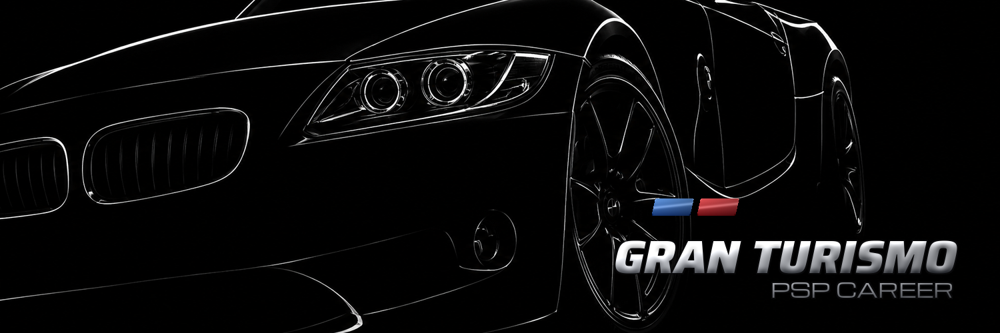
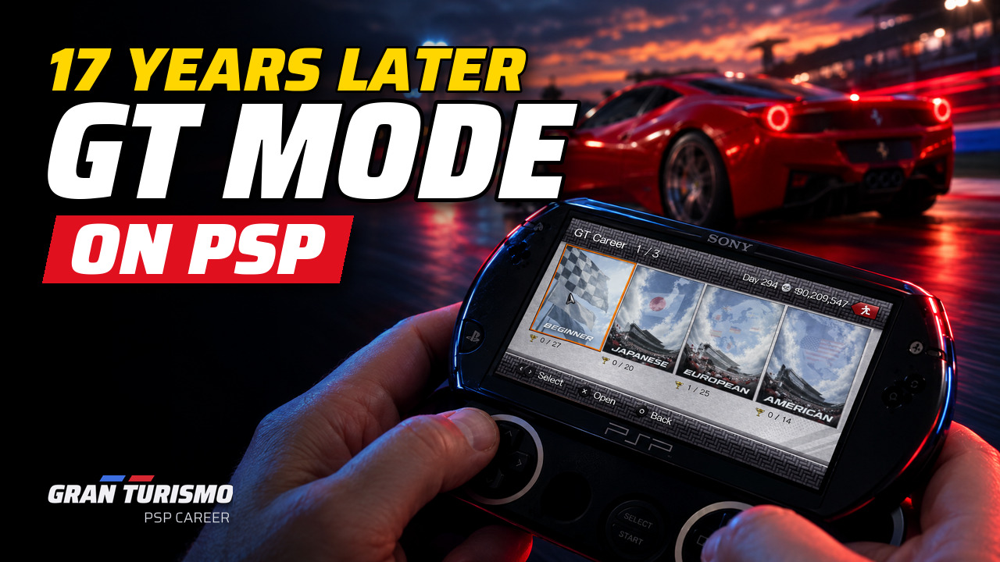
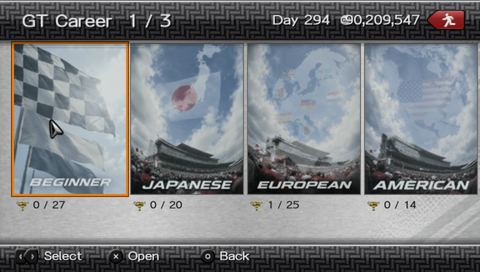
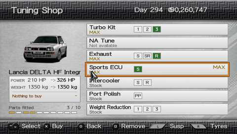
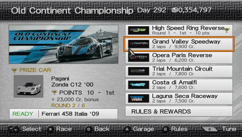
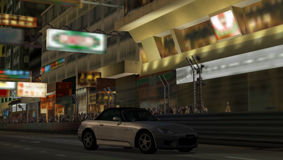
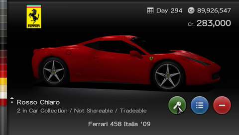

# Gran Turismo PSP Career 1.0.0

Released on October 1, 2026, seventeen years to the day after Gran Turismo PSP.

Gran Turismo PSP Career is a fan-made career mode for **Gran Turismo PSP USA (UCUS98632 v2.00)**: nine halls of events, prize cars, a parts shop, championships and endurance races, all on GT PSP's own cars and tracks.

It is an independent project, not a continuation or rework of anyone else's mod.

## Watch the trailer

## In the game

| Career halls | Tuning shop |
| --- | --- |
|  |  |
| Championship | Hong Kong |
|  |  |

## Download and install

You need your own, unmodified **Gran Turismo PSP USA** ISO. The patch does not include the game.

1. **[Find the right patch for your ISO](https://memetrix.github.io/gran-turismo-psp-career/)**: the page checks your ISO on your device and links the matching patch. The ISO is never uploaded.
2. Apply the `.xdelta` with Delta Patcher (Windows, macOS) or UniPatcher (Android). [INSTALL.md](INSTALL.md) has the steps and the table of patches.
3. Copy the finished ISO to your PSP's `ISO` folder or open it in PPSSPP.

All downloads are on the [1.0.0 release page](https://github.com/Memetrix/gran-turismo-psp-career/releases/tag/v1.0.0).

## Saves

No game ISO, save file, or test profile is included in this release. Back up your savedata before installing. The career uses its own `UCUS98632-CAREER` slot; on first launch it copies the garage and credits from the stock `UCUS98632-GAMEDAT` slot when present. The stock slot is not overwritten.

The career remembers bought tuning for up to **128 cars**. Beyond that, a new car cannot be tuned until a tuned car is sold.

## What's in 1.0.0

- **Five lost tracks, racing on a real PSP:** Complex String, Smokey Mountain, Tahiti Dirt, Rome and Hong Kong were cut from GT PSP. They are back as full events in the career and run on PSP hardware, not only in an emulator.
- **289 events** across nine halls: Beginner, Japanese, European, American, Professional, Extreme, Special Conditions, Endurance and One-Make.
- Of these, **125 are classic GT4 events** played by the original game's rules, listed first in their halls. The other **164 are the career's own**, with rules of their own, including power limits in Beginner.
- **Ferrari 458 Italia:** We found a mention of it in GT PSP's code: an entry in the car list and one color, Rosso Chiaro. Polyphony planned the car and cut it before release. This mod adds it, with its data and engine sound ported from Gran Turismo 5. Sold at the Ferrari dealer for 283,000 Cr.
- **18 endurance races** at classic length, up to 24 hours, split into saved segments.
- **Championships** with shared points and the same rivals through the season.
- **Parts shop** priced after GT4 (USA): engine upgrades, weight reduction, suspension and tyres, including dirt and snow. Almost every car can be tuned; the formula cars are limited, as in GT4.
- **Suspension screen in real units:** springs in kgf/mm, ride height in mm, camber in degrees. Tyre grip is shown as a friction coefficient, with the surface it is for: tarmac, dirt or snow.
- **Snow tyres as in GT4,** with their own compound on snow and dirt.
- **Repeatable prizes** in the career's own events: win the event again with no copy of its prize car in your garage, and you get the car again. The classic GT4 events give their prize car for the first win only, as in GT4.
- **Selling cars:** up to 500,000 Cr a car sells back for a quarter of its price; dearer ones for a tenth, never less than 125,000 Cr.
- **Every dealer is open every day,** as in GT4.
- Its own key art and XMB icon.

## Known issues

- **Rome runs slow** at the PSP's standard CPU clock: about 0.7x speed (50 seconds of game time per 1:10 of real time). The races are playable and finish normally. For full speed, set the game CPU clock to 333 MHz in your custom firmware's menu; no plugin is needed.
- **Graphical glitches on all lost tracks**, most visible on Complex String. They don't affect driving. Complex String, Hong Kong, Smokey Mountain and Tahiti Dirt run at full speed.
- **Tahiti Dirt replays** use camera positions from another track, so the replay can show the sea and cars in the air. The race itself is not affected.
- When an endurance segment starts near the finish line, the **best-lap display** can show the first partial lap as a very short lap. The race result is not affected.
- **PSP-1000: a race may not start.** On a PSP-1000 the game can stay on the loading screen before a race. The PSP-1000 leaves the game about 350 KB of spare memory; if plugins and the ISO driver take more than that, no race loads, whatever the car and its tuning. Turn off game plugins and try again, and tell us your firmware and plugins if it still happens.

Played on a PSP Go with custom firmware (ARK-5).

## Report a problem

[Open an issue](https://github.com/Memetrix/gran-turismo-psp-career/issues) with the console model or PPSSPP version, event and round, what happened, and whether it survives a cold launch. Do not post copyrighted ISO files or personal saves publicly.

Source code (GPL-3.0) and licence notices: see [NOTICE.md](NOTICE.md) and the source archive on the release page.
